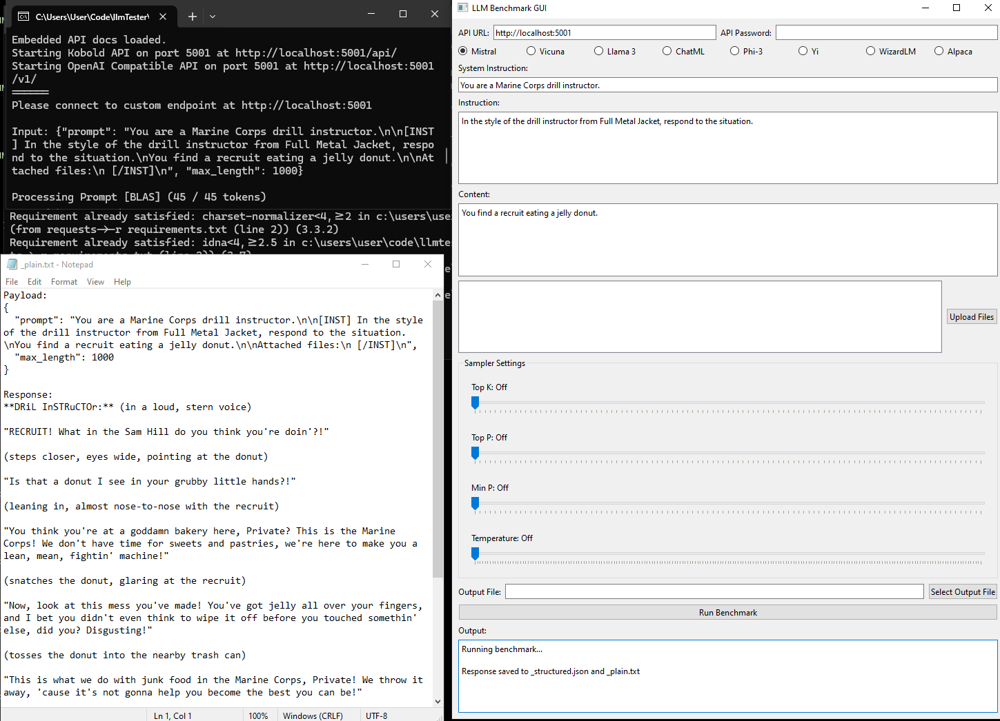

# LLMTester

[](https://opensource.org/licenses/MIT)

LLMTester lets you test new models and figure out prompting styles and sampler settings.


## Features

- You use it to make consistent prompts and send content to a Koboldcpp API
## Table of Contents

- [Installation](#installation)
- [Usage](#usage)
- [Configuration](#configuration)
- [FAQ](#FAQ)
- [Contributing](#contributing)
- [License](#license)

## Installation

### Windows

1. Clone the repository or download the zip file and extract it.

2. Install [Python for Windows](https://www.python.org/downloads/windows/).

4. Download [KoboldCPP.exe](https://github.com/LostRuins/koboldcpp/releases) and place it in the LlavaImageTagger folder.

5. Run `llmTester-run.bat` and wait for the model weights to download and Koboldcpp to start. 

The script will set up the Python environment, install dependencies, and download necessary model weights. This initial setup is performed only once and will take a few minutes depending on your download speed.

## Usage

1. Ensure KoboldCPP is running. Do not use the GUI windows until you see:
   ```
   Please connect to custom endpoint at http://localhost:5001
   ```


## Configuration

## FAQ

## Contributing

Contributions are welcome! Please feel free to submit a Pull Request.

## License

This project is licensed under the MIT License - see the [LICENSE](LICENSE) file for details.
